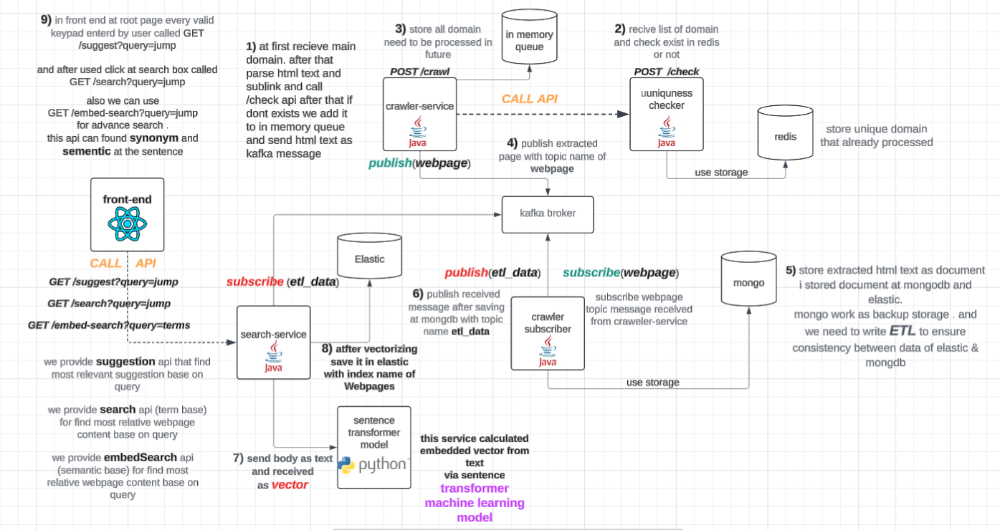
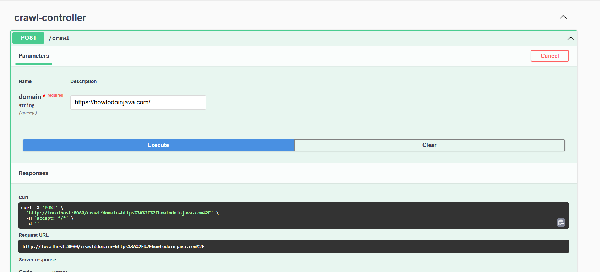
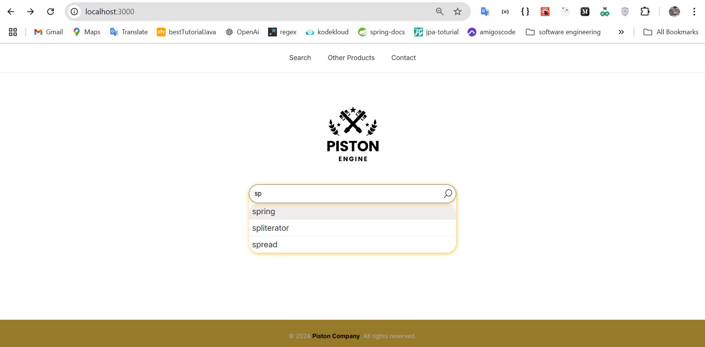

this repo created for learning how web search engine such as google work and write some project with crawler and other concept of search engine

----------------------

🤩🤩🤩  .Wow we are implement lightweight web search engine same as Google 

## general overview of implementation of web search engine with elastic search  

we implemented web search engine with elastic.  
😎😎 in next version we want to implement key functionality of elastic instead of using it. 
.
### get started with project

it's very easy to run that

1) install Docker from official page
2) use following command

         cd .\deployment\
         docker-compose up

2) its amazing all services and dependency installed and configured properly

--------------------------------------------------

after run all service & dependency for project to work correctly
we need two thing

1) add domain with crawler-service to crawler that domain and related page .and automatically index that in search-service from crawled webpage

we do it manually from swagger . but we can generate ui for that and only admin user can do that

2) using search-service endpoint to retrieve clear result

we fortunately create ui for show suggestion and search from index

i generate ui for autocomplete in search-box and select that. like picture bellow

-----------------------------------------------------------------

and after select input we search base on query to find most related document and rank them. like picture bellow

 
over time our dataset is larger and our suggestion it can be more precise and search result is more
