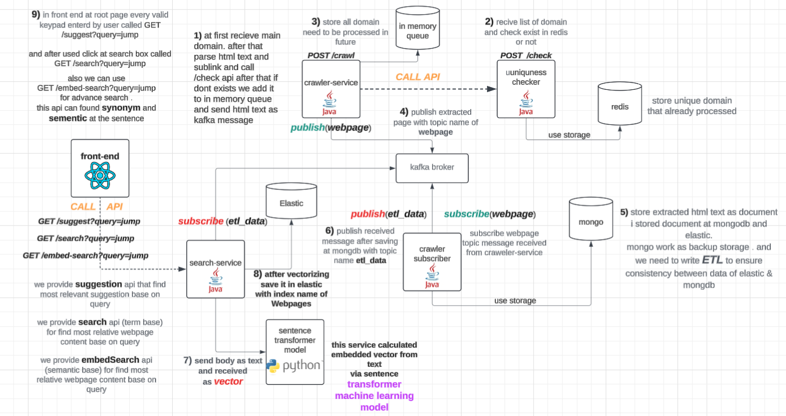

this repo created for learning how web search engine such as google work and write some project with crawler and other concept of search engine

----------------------

🤩🤩🤩  .Wow we are implement lightweight web search engine same as Google 

## general overview of implementation of web search engine with elastic search  

we implemented web search engine with elastic.  
😎😎 in next version we want to implement key functionality of elastic instead of using it. 
.
### get started with project

1) at first need to run <b>mongodb service</b> locally on port 27017 .

you can run it with docker with following command.

    docker run --name mongodb -p 27017:27017 -d mongodb/mongodb-community-server:latest

2) next you need to run redis server locally. you can do it in different approach . by wsl or docker

install by wsl

after open wsl terminal use 
        
        sudo apt update

to ensure package list updated. after that install redis with following command

    sudo apt install redis-server
 
after that start redis-server with command

    sudo service redis-server start

3) setup elastic search cluster locally on port 9200

        1) goes through elastic search official page and download related zip file
        2).and after extract them and run elasticsearch.bat in bin directory
        3)also you need to set password (123456) for sudo (elastic) user . to work correctly in search-service

4) setup kafka cluster for work as internal collaboration between services.(transfer webpage & etl)

step1) Download kafka

    go to Apache Kafka download page . and download binary file of that

step2) extract kafka
    
    extract binary file using zip or winrar. move to extracted directory

step3) start zookeeper
    
    \bin\windows\zookeeper-server-start.bat .\config\zookeeper.properties

step4) start kafka server

    .\bin\windows\kafka-server-start.bat .\config\server.properties

5) start crawler-service that run at port 8080
6) start uniqueness-checker-service that run at port 8081
7) start crawler-subscriber-service that run at port 8082
8) start search-service that run at port 8083

9) for using ui app need to execute following command

install nodejs

    Go to the official Node.js website and download lts version of that . should .msi file(for windows)
    after install successfuly it include npm (node package manager)

install node-module  
go to ui-search-app directory and use following command to install modules

    npm install

after node-module directory created you can run that with following command

    npm start

--------------------------------------------------

after run all service & dependency for project to work correctly
we need two thing

1) add domain with crawler-service to crawler that domain and related page .and automatically index that in search-service from crawled webpage

we do it manually from swagger . but we can generate ui for that and only admin user can do that

2) using search-service endpoint to retrieve clear result

we fortunately create ui for show suggestion and search from index

i generate ui for autocomplete in search-box and select that. like picture bellow

-----------------------------------------------------------------

and after select input we search base on query to find most related document and rank them. like picture bellow

 
over time our dataset is larger and our suggestion it can be more precise and search result is more
